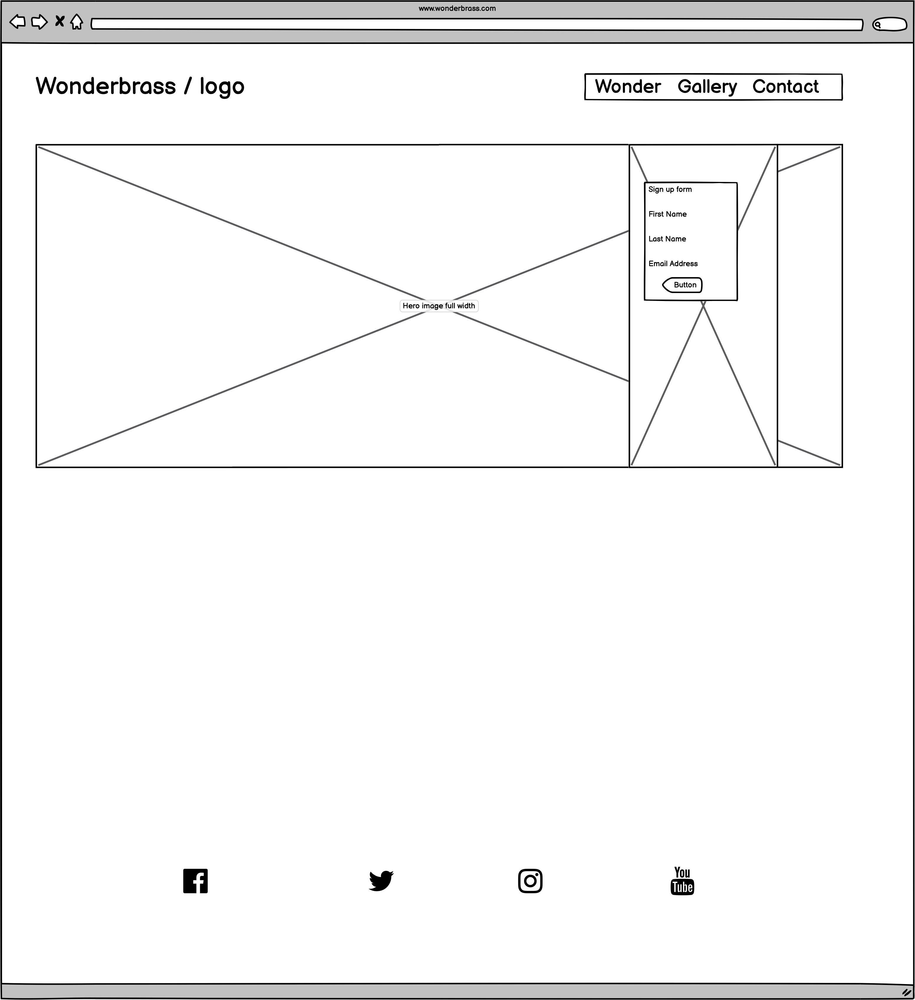

# Wonderbrass Band webpage - https://davidbuck84.github.io/Wonderbrass-MS1-project/

This page was created by David Buck, it's primary purpose is to promote the community band "Wonderbrass" based in Cardiff, South Wales. 

My wife is a member of the band and she suggested their website was to busy and tired looking.

The website has been created with a mobile first design, and is easy to navigate to the revelevent areas.

 
 
 

# User Stories

* **Visitor goals**

    * When a first time user visits this page, they want to easily understand the purpose of the page.
    
    * See and hear the music.
    
    * Easily find contact details for the band. 

    * Find links to band youtube content and social media.

* **Returning visitor goals**

    * When a user returns to this page, they would like to find content is updated regulary.

    * Easily be able to contact the band.

    * Find links to band youtube content and social media.

* **Band's goals**

    * Promote the band.

    * Recruit new members.

 
 
 

# Website design

* **Colour schemes**

    * There are two main colours used in the design, orange and white text with a black background. 
    
    color: rgb(255, 166, 0) = Orange

     

* **Fonts**

    * Two fonts were used from Google fonts. These were "Oswald" and "Zen Dots". Both were given a backup of "cursive".

    https://fonts.google.com/specimen/Oswald

    https://fonts.google.com/specimen/Zen+Dots
 
 

* **Images**

    * The site comprises of one extra large Hero Image, with a text overlay on both the home screen and and contact page.
 
 
 

* **Wireframes**

    * Home page Wireframe 
    * Gallery Wireframe 
    * Contact us Wireframe 
    * Mobile Wireframe 
 
 
 

# Site Features

* Website is responsive to variable device screen sizes using Media Queries and Bootstrap libraries

* Features simple and clean navigation links and sign up page for more band info.

 
 
 

# Technologies used

* **Languages Used**
    
    * HTML5
    * Bootstrap V4.3.1
    * CSS3
 
 

* **Frameworks / Libraries Used**

    1. Google Fonts - https://fonts.google.com/
        * Google fonts were used to adjust the styling of the page.

    2. Font Awesome - https://fontawesome.com/
        * Font awesome was used to provide social media links at the footer of each page.

    3. Git Hub - https://github.com/
        * GitHub was used to store the projects code after being pushed from Git.

    4. Git Pod - https://www.gitpod.io/
        * Gitpod was used for version control by utilizing the Gitpod terminal to commit to Git and Push to GitHub.

    5. Hover.css: 
        * Hover.css was used on the navbar to highlight the links on mouse over.

    6. Balsamiq - https://balsamiq.com/wireframes/?gclid=Cj0KCQjwp86EBhD7ARIsAFkgakhVuPEb7QuTFo-Biei-9EleUWZkzatOTcrJQtaCN4TnSDZ50Mr31vsaAhJ4EALw_wcB
        * Was used to creat wireframes in the plannig of the project.

    7. Bootstrap - https://getbootstrap.com/
        * Bootstrap was used to assist with the responsiveness and styling of the website.
 
 
 
# Testing

This site has been tested through 2 Validators.

* **Validators**
    
    * W3C HTML Markup Validator - https://validator.w3.org/ - 

    * W3C CSS Validator - https://jigsaw.w3.org/css-validator/ - 

 
 
 

# User Story tests

* **First Time visitor testing**

    * When first loading the site, the user sees a large hero image with overlay text.
    
    * Easy navigation links to conatact the band and view media content.

    * Contact links can be found at the bottom of the main home page, or through the nav bar links.

 

* **Returning visitor goals**

    * When a user returns to this page they will find content is updated regularly. As well as social media links and content remaining current.

    * Easily be able to contact the band through contact us page.

 
 
 

# Further Testing

* Website has been loaded on multiple browsers, such as Chrome, Safari, Internet Explorer and Firefox.

* It has been tested for mobile responsiveness using Chrome Dev Tools.

* Friends and family have experience the website and have been asked for feedback.

* Changes have made to responsiveness after publishing to GitPages and testing on real world devices.

* This site has also been subjected to "Google Chrome, Dev Tools Lighthouse Report"

 

 
 
 

# Known Bugs

The embeded youtube video on index.html is not very responsive, after multiple tests and discussions with colleagues, I have reached the conclusion that the low quality of the original video, prevents the expected result.

 
 
 

# Things to Change or Implement in the Future

* The website was coded using HTML5 and Custom CSS3. 

* Whilst adding Bootstrap 4.4.1 at a later stage in the project, this subsquently overwrote the custom CSS and affected the layout/responsiveness of the site. With hindsite, Bootstrap should have been implemented from the start of the project, allowing me to make the site more responsive on a greater range of devices. It would also allow me to add more custom/fluid CSS content.

                    ----------- edit ------------

* All future projects, Bootstrap and other libraries will be added at the start of the project. 

 
 
 

# Deployment (Credit GITHUB template README)

* **GitHub Pages** 

    * The project was deployed to GitHub Pages using the following steps...

1. Log in to GitHub and locate the GitHub Repository
2. At the top of the Repository (not top of page), locate the "Settings" Button on the menu.
3. Scroll down the Settings page until you locate the "GitHub Pages" Section.
4. Under "Source", click the dropdown called "None" and select "Master Branch".
5. The page will automatically refresh.
6. Scroll back down through the page to locate the now published site link in the "GitHub Pages" section.

* **Forking the GitHub Repository**

    * By forking the GitHub Repository we make a copy of the original repository on our GitHub account to view and/or make changes without affecting the original repository by using the following steps...

1. Log in to GitHub and locate the GitHub Repository
2. At the top of the Repository (not top of page) just above the "Settings" Button on the menu, locate the "Fork" Button.
You should now have a copy of the original repository in your GitHub account.

* **Making a Local Clone**
1. Log in to GitHub and locate the GitHub Repository
Under the repository name, click "Clone or download".
2. To clone the repository using HTTPS, under "Clone with HTTPS", copy the link.
3. Open Git Bash
4. Change the current working directory to the location where you want the cloned directory to be made.
5. Type git clone, and then paste the URL you copied in Step 3.
$ git clone https://github.com/YOUR-USERNAME/YOUR-REPOSITORY
Press Enter. Your local clone will be created.
$ git clone https://github.com/YOUR-USERNAME/YOUR-REPOSITORY
> Cloning into `CI-Clone`...
> remote: Counting objects: 10, done.
> remote: Compressing objects: 100% (8/8), done.
> remove: Total 10 (delta 1), reused 10 (delta 1)
> Unpacking objects: 100% (10/10), done.

(Credit GITHUB template README)

 
 
 

# Content

* The full hero image came from Shutter Stock - https://tinyurl.com/d6c7w2en

* Quotes and videos were taken from https://wonderbrass.org.uk as my project was to upgrade their website.

* All other content was written by the developer David Buck.

* All Balsamiq content was created by the developer David Buck.

 
 
 

# Credits

* My mentor Gerard Mc Bride.

* Tutor support for helping fix issues in my sign up form.

* The Slack comunity. With special thanks to "Maggie Walsh", and "BrianMike"

* Github and Code Institute sample readme files.

